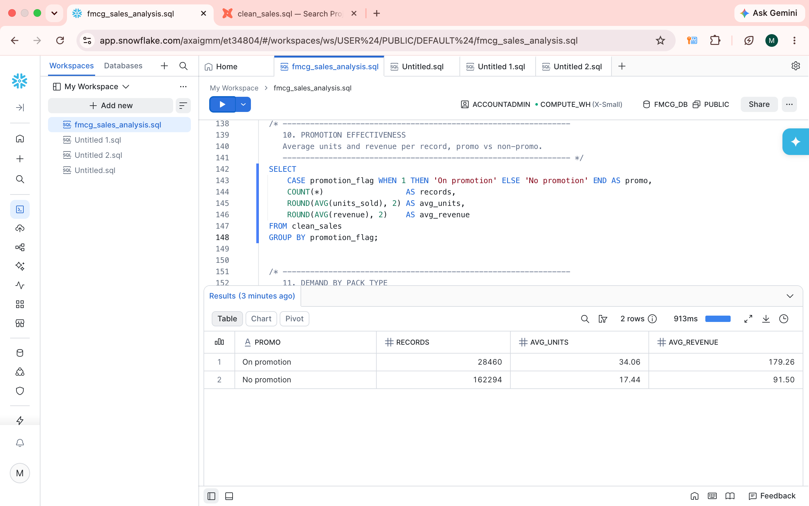
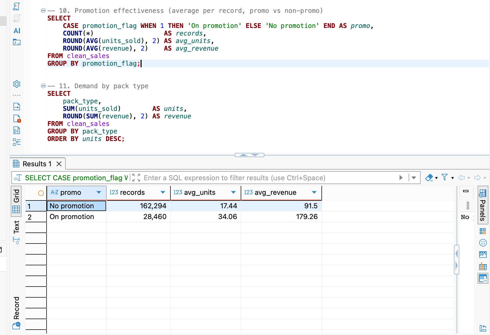
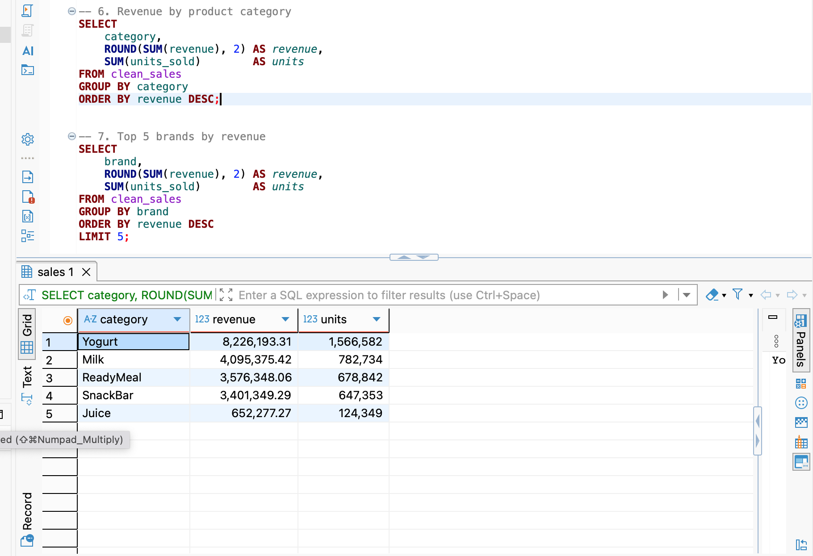

# FMCG Daily Sales Analysis (2022–2024) — SQL

**Author:** Moses Ndonga
**Tools:** SQL (SQLite & Snowflake) · DBeaver
**Dataset:** [FMCG Daily Sales Data 2022–2024 (Kaggle)](https://www.kaggle.com/datasets/beatafaron/fmcg-daily-sales-data-to-2022-2024) — ~190,000 daily sales records

## Overview

This project analyses three years of daily fast-moving-consumer-goods (FMCG) sales — milk, yogurt, ready meals, juice and snack bars — across three sales channels (Retail, Discount, E-commerce) and three regions. The goal is to answer the questions a grocery business asks every day: which categories, brands and channels drive revenue, whether promotions actually work, and where sales are being lost to stock gaps — so the business can make better range, pricing and availability decisions.

The dataset is used as a realistic stand-in for the kind of store-and-product analysis a large grocer (e.g. Sainsbury's) performs on its own data.

## Also reproduced in Snowflake

To demonstrate cloud data warehouse skills, I reproduced this entire analysis in **Snowflake**. I loaded the ~190,000-row CSV into a Snowflake table, rebuilt the cleaned `clean_sales` view, and re-ran all 12 queries — adapting the SQL from SQLite to Snowflake's dialect (e.g. `strftime()` → `YEAR()` / `MONTH()` for the date-based queries).

All results matched the original SQLite output exactly (total revenue £19,951,543; 190,754 clean records; promotions lifting average revenue per record from £91.50 to £179.26).

The Snowflake version of the script is in [`fmcg_sales_analysis_snowflake.sql`](fmcg_sales_analysis_snowflake.sql).

This analysis was subsequently rebuilt as a governed dbt pipeline with automated testing and lineage — see [fmcg-dbt-snowflake](https://github.com/mosesndonga02-cell/fmcg-dbt-snowflake).

## Approach

1. **Loaded** the raw CSV into a SQLite database as a `sales` table (~190,757 rows).
2. **Checked data quality** and found a small number of impossible records (negative units sold and negative stock).
3. **Built a cleaned `clean_sales` view** that removes those invalid rows and derives a `revenue` column (`price_unit × units_sold`), so all analysis runs on trustworthy data.
4. **Wrote 12 SQL queries** answering the business questions below — using aggregation, `GROUP BY`, date functions, subqueries, `HAVING` and `CASE`.

All queries are in [`fmcg_sales_analysis.sql`](fmcg_sales_analysis.sql).

## Headline numbers

| Metric | Value |
|---|---|
| Total revenue | £19,951,543 |
| Total units sold | 3,799,860 |
| Clean records analysed | 190,754 |
| Average unit price | £5.25 |

*Data cleaning: 3 invalid records (negative units/stock) were identified and removed before analysis.*

## Key findings

**1. Promotions roughly double sales.** This is the standout result. On a like-for-like, per-record basis:

| | Avg units per record | Avg revenue per record |
|---|---|---|
| No promotion | 17.44 | £91.50 |
| On promotion | 34.06 | £179.26 |

Promotions lift both units and revenue by ~95%, making promotional activity highly effective and worth protecting in the plan.

**2. Yogurt is the engine of the business.** It alone accounts for ~41% of all revenue; Juice is by far the smallest category.

| Category | Revenue | Units |
|---|---|---|
| Yogurt | £8,226,193 | 1,566,582 |
| Milk | £4,095,375 | 782,734 |
| ReadyMeal | £3,576,348 | 678,842 |
| SnackBar | £3,401,349 | 647,353 |
| Juice | £652,277 | 124,349 |

**3. Growth surged, then plateaued.** Revenue jumped sharply from 2022 to 2023, then held roughly flat into 2024 — worth investigating what stalled momentum.

| Year | Revenue | Units |
|---|---|---|
| 2022 | £3,166,962 | 604,945 |
| 2023 | £8,436,477 | 1,605,036 |
| 2024 | £8,348,105 | 1,589,879 |

**4. Sales peak in summer.** The strongest months are July, June, May and August — useful for timing stock and promotions. The weakest are January and February.

**5. E-commerce is on par with Retail.** The three channels are almost evenly balanced, so the online channel already pulls its full weight.

| Channel | Revenue | Share |
|---|---|---|
| Retail | £6,655,807 | 33.4% |
| E-commerce | £6,653,435 | 33.3% |
| Discount | £6,642,301 | 33.3% |

**6. Availability risk sits in the top seller.** Yogurt has by far the most zero-stock records (1,472), meaning the biggest category is also the most exposed to empty shelves and lost sales.

| Category | Zero-stock records |
|---|---|
| Yogurt | 1,472 |
| Milk | 881 |
| ReadyMeal | 696 |
| SnackBar | 661 |
| Juice | 150 |

Top brand overall is SnBrand2 (£2.86M), and demand is split almost evenly across Single, Carton and Multipack pack types.

## Recommendations

1. **Protect promotional investment** — promotions reliably ~double sales per record.
2. **Prioritise Yogurt availability** — the top revenue category is also the most stock-constrained; fixing this recovers lost sales directly.
3. **Investigate the 2023→2024 plateau** — understand why strong growth stalled and whether it's a range, pricing or demand issue.

## How to reproduce

1. Download the CSV from the Kaggle link above.
2. Open DBeaver → create a new **SQLite** database (`fmcg.db`).
3. Right-click the connection → **Import Data** → **CSV** → import as a table named `sales`.
4. Open a new SQL script, run the `CREATE VIEW clean_sales` block first, then run any query in `fmcg_sales_analysis.sql`.

## Files

| File | Description |
|---|---|
| `fmcg_sales_analysis.sql` | All 12 SQL queries, commented |
| `README.md` | This report |
